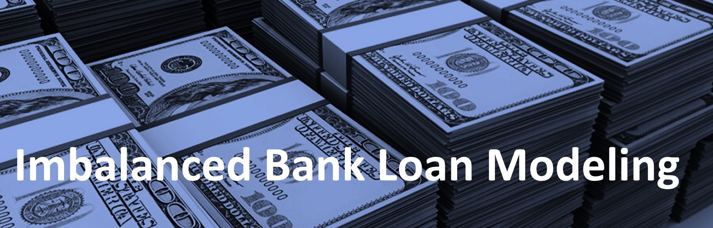

# 💳 Imbalanced Personal Bank Loan Classification

## 🌐 Overview
Thera-Bank's majority of customers are depositors with only a small fraction being borrowers. With a goal to augment this borrower base, the bank is keen on exploring strategic ways to convert its liability customers into personal loan customers, maintaining them as depositors. Leveraging insights from a past campaign that witnessed a 9.6% success conversion rate, the retail marketing department aspires to craft more effective campaigns with precision targeting. This project endeavors to develop a classifier to help pinpoint potential customers more likely to opt for a loan, elevating the success rate while optimizing campaign costs.

## 🚩 Problem
In this project, we address the challenge of classifying personal loans using the **Thera-Bank dataset**. The objective is to assist the bank in recognizing potential customers more inclined towards obtaining a loan, thus refining the efficacy of the marketing campaigns and boosting their conversion rate. A pivotal aspect of this dataset is its imbalanced nature, which can bias the model towards the majority class. To counteract this, we've applied various techniques to balance the dataset, ensuring a fair representation of both classes.

## 🎯 Objectives
- **Exploring and Preprocessing Data**: Deeply analyze and prepare the data for modeling, with special emphasis on understanding and addressing the imbalanced nature of the dataset. 

- **Model Building**: Utilize a spectrum of classification models, with a particular focus on penalized and tree-based algorithms, to forecast the likelihood of a customer procuring a personal loan. Models include:
  - Complement Naive Bayes
  - Bernoulli Naive Bayes
  - Logistic Regression
  - Decision Tree
  - K-Nearest Neighbors
  - SVM
  - Random Forest
  - AdaBoost
  - Gradient Boosting
  - Extra Trees
  - XGBoost
  
- **Evaluation**: Gauge the performance of models, especially focusing on metrics crucial for imbalanced datasets like the F1-score, Precision, Recall, and the Area Under the Receiver Operating Characteristic Curve (AUC-ROC).

## 📊 Dataset
The dataset embodies both customer particulars and their response to the most recent personal loan campaign:

<table style="width:100%">
<thead>
<tr>
<th style="text-align:center; font-weight: bold; font-size:20px">Variable Name</th>
<th style="text-align:center; font-weight: bold; font-size:20px">Description</th>
</tr>
</thead>
<tbody>
<tr><td><b>
ID
</b></td><td>ID of the customer</td></tr>
<tr><td><b>
Age
</b></td><td>Age of the customer in completed years</td></tr>
<tr><td><b>
Experience
</b></td><td>Amount of work experience in years</td></tr>
<tr><td><b>
Income
</b></td><td>Amount of annual income (in thousands)</td></tr>
<tr><td><b>
Zipcode
</b></td><td>Postal code in which the client lives</td></tr>
<tr><td><b>
Family
</b></td><td>Number of family members</td></tr>
<tr><td><b>
CCAvg
</b></td><td>Average monthly spending with the credit card (in thousands)</td></tr>
<tr><td><b>
Education
</b></td><td>Education level (1: bachelor's degree, 2: master's degree, 3: advanced/professional degree)</td></tr>
<tr><td><b>
Mortgage
</b></td><td>Value of home mortgage, if any (in thousands)</td></tr>
<tr><td><b>
Securities Account
</b></td><td>Does the customer have a securities account with the bank?</td></tr>
<tr><td><b>
CD Account
</b></td><td>Does the customer have a CD account with the bank?</td></tr>
<tr><td><b>
Online
</b></td><td>Does the customer use internet banking facilities?</td></tr>
<tr><td><b>
CreditCard
</b></td><td>Does the customer use a credit card issued by the bank?</td></tr>
<tr><td><b>
Personal Loan
</b></td><td>Did this customer accept the personal loan offered in the last campaign? (Target Variable)</td></tr>
</tbody>
</table>

Access the dataset on Kaggle [here](https://www.kaggle.com/datasets/itsmesunil/bank-loan-modelling).

## 📁 File Descriptions
- 📓 **`imbalanced-personal-bank-loan-classification.ipynb`**: Jupyter notebook elucidating the exploration, preprocessing, handling imbalanced data, modeling, and evaluation stages.
  
- 📄 **`Bank_Personal_Loan_Modelling.csv`**: CSV file comprising the training and test data.
  
- 📘 **`README.md`**: This very document you're perusing! A primer to grasp the project.

## 🚀 How to Execute
1. Clone this repository to your local machine.
2. Open the `imbalanced-personal-bank-loan-classification.ipynb` notebook in Jupyter.
3. Run all cells in the notebook.

## 🔗 Additional Resources
- **Kaggle Notebook**: Interested in exploring within a Kaggle environment? View the notebook [here](https://www.kaggle.com/code/farzadnekouei/imbalanced-personal-bank-loan-classification/notebook).
- **LinkedIn**: [Farzad Nekouei's Profile](https://www.linkedin.com/in/farzad-nekouei-7535aa53/)
